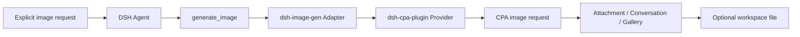

<div align="center">


<br /><br />

# 🎨 dsh-image-gen

**Generate images in DeepSeek Harness through a CPA Provider, with native DSH Attachments, Gallery, and optional workspace output.**

[](https://www.npmjs.com/package/dsh-image-gen)
[](https://github.com/deepseek-ai)
[](LICENSE)

**English** | [简体中文](README.md)

<br />

<p align="center">After installing the Provider and Adapter, ask the Agent:</p>

```text
Draw a cyberpunk cat on a neon street in a rainy night.
```

<p align="center">For an explicit image request, the Agent calls <code>generate_image</code> and the result is attached to the conversation.</p>

<br />


</div>

---

## Architecture

`dsh-image-gen` is an Adapter for the tool, DSH Attachments, Gallery, and workspace output. The separately installed `@LiuRJ99/dsh-cpa-plugin` Provider owns model IDs, request protocols, and credentials; the ImageGen settings do not store a Provider key.



## Install and configure

Install the Provider first, then the Adapter in the same DSH Web profile:

```bash
dsh plugin --profile web add @LiuRJ99/dsh-cpa-plugin
dsh plugin --profile web add dsh-image-gen@0.4.0
```

Local release tarballs use the same command shape:

```bash
dsh plugin --profile web add <provider-package-or-tarball>
dsh plugin --profile web add <image-plugin-package-or-tarball>
```

Configure the model route and credentials in the CPA Provider, then verify that the Host route contains `gpt-image-2` or `gemini-3.1-flash-image`. In **Settings → Plugins → Image generation**, choose only the engine (`GPT Image 2` or `Gemini Image`) and workspace controls. The former Provider, API key, Endpoint, and raw-model fields are not part of the current ImageGen setup.

The ordinary model selector hides image-only models `gpt-image-1.5`, `gpt-image-2`, and `gemini-3.1-flash-image`; `gemini-3.1-flash-lite` remains available as a regular text model.

## Two CPA protocol paths

| Engine | CPA request path | Image result |
| :--- | :--- | :--- |
| **GPT Image 2** | `/v1/images/generations` | `data[].b64_json` |
| **Gemini Image** | `/v1/chat/completions` | `choices[0].message.images[].image_url.url` |

Both engines start from `generate_image`. The Adapter saves successful results as DSH Attachments and presents them in the conversation; workspace saving is optional.

## Key capabilities

- 💬 Explicit in-chat image generation through `generate_image`.
- 🖼️ Native DSH Attachment, Conversation, and Gallery persistence.
- 💾 Optional image files in the current session workspace.
- 🎨 Provider-owned model routing, protocols, and credentials; the Adapter neither reads nor stores Provider keys.

## Local development

```bash
pnpm install
pnpm run typecheck
pnpm run test
pnpm run build
pnpm run pack:check
```

## License

Open-sourced under the [MIT License](LICENSE).
