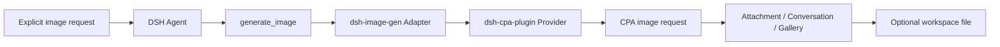

<div align="center">


<br /><br />

# 🎨 dsh-image-gen

**Generate images in DeepSeek Harness through a CPA Provider, with native DSH Attachments, Gallery, and optional workspace output.**

[](https://www.npmjs.com/package/dsh-image-gen)
[](https://github.com/deepseek-ai)
[](LICENSE)

**English** | [简体中文](README.md)

<br />

<p align="center">After installing the Provider and Adapter, ask the Agent:</p>

```text
Draw a cyberpunk cat on a neon street in a rainy night.
```

<p align="center">For an explicit image request, the Agent calls <code>generate_image</code> and the result is attached to the conversation.</p>

<br />


</div>

---

## Architecture

`dsh-image-gen` is an Adapter for the tool, DSH Attachments, Gallery, and workspace output. The separately installed `@LiuRJ99/dsh-cpa-plugin` Provider owns model IDs, request protocols, and credentials; the ImageGen settings do not store a Provider key.



## Install and configure

The current `@LiuRJ99/dsh-cpa-plugin` is a private sibling Provider in this checkout and must not be assumed to exist on the public registry. In a monorepo/internal profile, install the sibling package or an approved Provider tarball first, then install the Adapter:

```bash
dsh plugin --profile web add <path-to-dsh-cpa-plugin-or-approved-provider-tarball>
dsh plugin --profile web add dsh-image-gen@0.5.0
```

If the Provider has been published inside the target profile, use its exact approved package name. The Adapter peer range does not pretend that the private Provider is independently installable; without the Provider, image generation routes are unavailable.

Local release tarballs use the same command shape:

Server-side thumbnails use the `sharp` peer supplied by the DSH host. Do not install another `sharp` copy into the Web profile, or macOS may load duplicate native `libvips` libraries.

```bash
dsh plugin --profile web add <provider-package-or-tarball>
dsh plugin --profile web add <image-plugin-package-or-tarball>
```

Configure the model route and credentials in the CPA Provider, then verify that the Host route contains `gpt-image-2` or `gemini-3.1-flash-image`. In **Settings → Plugins → Image generation**, choose only the engine (`GPT Image 2` or `Gemini Image`) and workspace controls. The former Provider, API key, Endpoint, and raw-model fields are not part of the current ImageGen setup.

The ordinary model selector hides image-only models `gpt-image-1.5`, `gpt-image-2`, and `gemini-3.1-flash-image`; `gemini-3.1-flash-lite` remains available as a regular text model.

## Two CPA protocol paths

| Engine | CPA request path | Image result |
| :--- | :--- | :--- |
| **GPT Image 2** | `/v1/images/generations` | `data[].b64_json` |
| **Gemini Image** | `/v1/chat/completions` | `choices[0].message.images[].image_url.url` |

Both engines support `generate_image` for new images and, when the CPA Provider exposes the optional edit capability, `edit_image` for editing or combining existing references. The Adapter saves successful results as DSH Attachments and presents them in the conversation; workspace saving is optional.

## Key capabilities

- 💬 Explicit in-chat generation through `generate_image`, plus reference-image editing and compositing through `edit_image`.
- 🖼️ Native DSH Attachment, Conversation, and Gallery persistence for generated and edited results.
- 💾 Optional image files in the current session workspace.
- 🎨 Provider-owned model routing, protocols, and credentials; the Adapter neither reads nor stores Provider keys.

## Inspiration and Gallery management

- **Inspiration Library**: a compact built-in catalog with fixed case/category/style/scene allowlists supports search, favorites, prompt copying, and one-click CPA generation with either GPT Image 2 or Gemini Image. Images try the fixed mirror first, then jsDelivr/GitHub; the browser submits case IDs, never arbitrary URLs.
- **Cache boundaries**: browser IndexedDB catalog/image caches are size-bounded. The optional Host disk cache is under `~/.dsh/cache/dsh-image-gen/inspiration`; failures fall back to generated built-in SVG previews and never block image generation. Refresh/clear removes plugin caches, and third-party requests are limited to the fixed HTTPS sources in code.
- **Gallery management**: Better Sidebar Gallery keeps the fork's DB v3 schema, thumbnail/full-image cache, and virtualized Grid/Table views while adding favorites, batch select/delete, current-workspace filtering, prompt copy, and CPA-only regeneration. List view displays the complete prompt.
- **Workspace governance**: normal `generate_image` writes only to the current agent session cwd using atomic writes and realpath containment. Dynamically discovered DSH workspaces are used only for strict root authorization; browser batch deletion accepts saved generated-file paths only, and browser regeneration creates an Attachment without expanding write authorization.

## Reference-image editing

The CPA service keeps `generate` backward-compatible and may expose an optional `edit` capability. When available, `edit_image` resolves DSH Attachments on the Host, uses images from the latest human message in upload order, and also supports explicit `source_attachment_ids` or workspace-contained `source_paths`. GPT uses `/v1/images/edits`; Gemini uses `image_url` data URLs in `/v1/chat/completions`.

With an older CPA Provider that has no `edit` method, the Adapter registers only `generate_image`; it never invents `edit_image`, copies attachments through shell commands, or claims an unverified result. A Studio native-provider backend, native model comparison, `provider=comfyui`, and Provider/BYOK/API-key configuration remain outside this package.

## Local development

```bash
pnpm install
pnpm run typecheck
pnpm run test
pnpm run build
pnpm run pack:check
```

## License

Open-sourced under the [MIT License](LICENSE).
