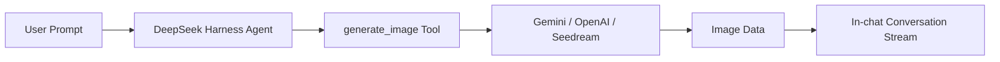

<div align="center">


<br /><br />

# 🎨 dsh-image-gen

**Bring ChatGPT-like image generation to DeepSeek Harness — with fullscreen preview, quick copy, and one-click download.**

[](https://www.npmjs.com/package/dsh-image-gen)
[](https://github.com/deepseek-ai)
[](https://www.npmjs.com/package/dsh-image-gen)
[](LICENSE)

**English** | [简体中文](README.md)

<br />

<p align="center">💬 <b>Prompt your DeepSeek Harness Agent to install:</b></p>

```text
Install the image generation plugin by running: pnpm dsh plugin --profile web add dsh-image-gen@latest
```

<p align="center"><sub>(Or run manually in terminal: <code>pnpm dsh plugin --profile web add dsh-image-gen@latest</code>)</sub></p>

<br />

<p align="center">After installation, enter your API Key in DSH Settings, then tell the Agent:</p>

```text
Draw a cyberpunk cat on a neon street in a rainy night.
```

<p align="center">The Agent will automatically call <code>generate_image</code> and display the image directly in the conversation.</p>

<br />


</div>

---

## 💡 What Problem Does It Solve?

**`dsh-image-gen` is an open-source image generation plugin built specifically for DeepSeek Harness (DSH).**

DeepSeek Harness empowers agents to use tools for various tasks. This project adds native **multimodal image generation capabilities**:



---

## 🚀 Quick Start

### 1. Install Plugin

Run in your DeepSeek Harness project root:

```bash
# Recommended: Install or upgrade to latest version
pnpm dsh plugin --profile web add dsh-image-gen@latest

# If dsh is installed globally:
dsh plugin --profile web add dsh-image-gen@latest
```

<details>
<summary><b>🛠️ Other installation methods (Git / Local development)</b></summary>

```bash
# Method B: Direct install from GitHub
pnpm dsh plugin --profile web add git+https://github.com/shanliuling/dsh-image-gen.git

# Method C: Local development install
git clone https://github.com/shanliuling/dsh-image-gen.git
pnpm dsh plugin --profile web add ./dsh-image-gen
```

</details>

### 2. Configure API Key

Open DSH Web (`http://localhost:3080` by default):

1. Go to **Settings → Plugins → Image generation**.
2. Select your Provider, enter your API Key, and click **Save**.

<div align="center">
  
</div>

### 3. Start Generating Images

Type in the chat box:

```text
Generate a minimalist modern architecture living room illustration.
```

The Agent will automatically invoke `generate_image` and render the image in the conversation.

---

## ✨ Features

- 💬 **In-chat Image Generation**: No need to switch tabs or copy prompts; chat naturally to generate images.
- 🔍 **Interactive Image Toolkit**: Click image for fullscreen preview (press `ESC` or click backdrop to close), hover toolbar to copy image to clipboard, download, or open in a new tab.
- 🎨 **Multi-Provider Support**: Supports Google Gemini, OpenAI Images, OpenAI-compatible APIs, and ByteDance Seedream / Volcengine Ark.
- 🔑 **BYOK (Bring Your Own Key)**: Securely managed through DSH `credentials` service with write-only protection; keys are never exposed in plaintext.
- 🖼️ **Durable Conversation Persistence**: Integrated with DSH Attachment system; images remain visible when reopening past sessions.
- ⚙️ **Native Settings UI**: Configure models, endpoints, and keys directly within DSH Web settings without editing config files.

---

## 📦 Supported Providers

| Provider | Default Model | Default Endpoint / Base URL |
| :--- | :--- | :--- |
| **Google Gemini** | `gemini-3.1-flash-image` | `https://generativelanguage.googleapis.com/v1beta/interactions` |
| **OpenAI Images** | `gpt-image-2` | `https://api.openai.com/v1` |
| **OpenAI Compatible** | Custom | Custom Base URL |
| **ByteDance Seedream / Ark** | `doubao-seedream-5-0-260128` | `https://ark.cn-beijing.volces.com/api/v3` |

---

## 🛠️ Local Development

```bash
# Clone repository
git clone https://github.com/shanliuling/dsh-image-gen.git
cd dsh-image-gen

# Install dependencies
pnpm install

# Build
pnpm run build

# Run unit tests
pnpm test
```

---

## 🤝 Contributing

Contributions are welcome! Please read [CONTRIBUTING.md](CONTRIBUTING.md) before submitting Pull Requests.

---

## 📄 License

[MIT](LICENSE) © 2026 shanliuling
