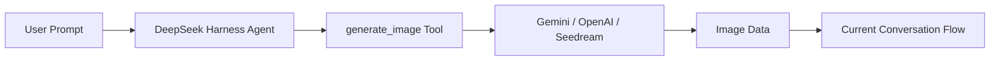

<div align="center">

# 🎨 dsh-image-gen

### 🔌 Native Multi-Provider Image Generation Plugin for DeepSeek Harness (DSH)
**Bring ChatGPT-like conversational image generation to DeepSeek Harness.**

Supports Google Gemini, OpenAI Images, OpenAI Compatible API, and ByteDance Seedream / Volcengine Ark.

[](https://www.npmjs.com/package/dsh-image-gen)
[](https://github.com/deepseek-ai)
[](https://www.npmjs.com/package/dsh-image-gen)
[](LICENSE)

**English** | [简体中文](README.md)

<br />

<p align="center">💬 <b>Just tell your DeepSeek Harness Agent:</b></p>

> 💬 *“Install the image generation plugin by running: `pnpm dsh plugin --profile web add dsh-image-gen`”*

<p align="center"><sub>(Or run manually in terminal: <code>pnpm dsh plugin --profile web add dsh-image-gen</code>)</sub></p>

<br />

<p align="center">Once installed, configure your API Key in DSH Settings, and simply tell your Agent:</p>

> 🎨 *"Create an illustration of a cyberpunk cat in a neon rainy street."*

<p align="center">The Agent will automatically invoke <code>generate_image</code>, generate the image, and render it directly inside the conversation.</p>

<br />


</div>

---

## 💡 What Problem Does It Solve?

**`dsh-image-gen` is an open-source image generation plugin designed natively for DeepSeek Harness (DSH).**

DeepSeek Harness allows Agents to execute various tools to complete tasks. This project complements it with native **multimodal image generation** capabilities:



> **It is not a standalone image generation website.**  
> It makes **Image Generation** a native, first-class tool plugin callable directly by DeepSeek Harness Agents.

---

## 🚀 Installation & Quick Start

### 1. Install Plugin

Run the following command in your DeepSeek Harness project root:

```bash
# Recommended: One-click installation via pnpm
pnpm dsh plugin --profile web add dsh-image-gen

# If dsh is installed globally:
dsh plugin --profile web add dsh-image-gen
```

<details>
<summary><b>🛠️ Alternative Installation Methods (Git / Local development)</b></summary>

```bash
# Method B: Install directly from GitHub repository
pnpm dsh plugin --profile web add git+https://github.com/shanliuling/dsh-image-gen.git

# Method C: Clone locally for development and testing
git clone https://github.com/shanliuling/dsh-image-gen.git
pnpm dsh plugin --profile web add ./dsh-image-gen
```
</details>

### 2. Configure API Key

Open your DSH Web interface (default: `http://localhost:3080`):

1. Navigate to **Settings → Plugins → Image generation**.
2. Select your provider, enter your API Key, and click **Save**.

<div align="center">
  
</div>

### 3. Generate in Chat

Ask the Agent directly in dialogue:

> 💬 *"Generate a minimalist modern architectural living room illustration."*

When the Agent decides to call the tool, it will execute `generate_image` and return the image card in the flow.

---

## 📦 Supported Providers

| Provider | Default Model | Default Endpoint / Base URL | Notes |
| :--- | :--- | :--- | :--- |
| **Google Gemini** | `gemini-3.1-flash-image` | `https://generativelanguage.googleapis.com/v1beta/interactions` | High quality and rich visual details |
| **OpenAI Images** | `gpt-image-2` | `https://api.openai.com/v1` | Standard OpenAI `/v1/images/generations` |
| **OpenAI Compatible** | Custom | Custom Base URL | Compatible with OneAPI, NewAPI, or custom relays |
| **ByteDance Seedream / Volcengine** | `doubao-seedream-5-0-260128` | `https://ark.cn-beijing.volces.com/api/v3` | Doubao image generation (direct access in China) |

---

## ✨ Key Features

- 💬 **Conversational In-Chat Generation**: No need to switch websites or copy-paste prompts. Simply ask the Agent what you want to draw.
- 🎨 **Multi-Provider Support**: Supports Google Gemini, OpenAI Images, OpenAI Compatible API, and ByteDance Seedream. Providers, models, and endpoints can be customized in the UI.
- 🔑 **BYOK (Bring Your Own Key)**: Use your own API keys. Managed securely through DeepSeek Harness `credentials` service with write-only protection — never stored in plaintext on the client.
- 🖼️ **Durable Conversation Attachments**: Generated images integrate directly into the DSH Attachment / Conversation system. Images remain visible even when reopening historical sessions.
- ⚙️ **Native Web Settings UI**: Easily adjust providers, keys, models, and endpoints from the Web UI without manually touching config files.

---

## 🎯 Example Prompts

Ask your Agent:

> 💬 *"Generate a cinematic concept art of a futuristic city at night, rain, neon reflections, 21:9."*

Or:

> 💬 *"Design a minimalist logo for an AI developer tool."*

The Agent will decide whether to invoke `generate_image` based on the context.

---

## 🛠️ Development

```bash
# Clone repository
git clone https://github.com/shanliuling/dsh-image-gen.git
cd dsh-image-gen

# Install dependencies and build
pnpm install
pnpm run typecheck
pnpm run test
pnpm run build

# Verify packaging contents
pnpm run pack:check
```

---

## 📄 License

This project is licensed under the [MIT License](LICENSE).

If this plugin is helpful to you, please consider giving it a ⭐️ **Star**!
