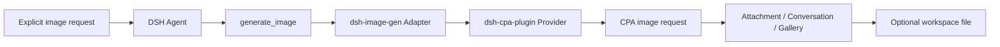

<div align="center">


<br /><br />

# 🎨 dsh-image-gen

**Generate images in DeepSeek Harness through a CPA Provider, with native DSH Attachments, Gallery, and optional workspace output.**

[](https://www.npmjs.com/package/dsh-image-gen)
[](https://github.com/deepseek-ai)
[](LICENSE)

**English** | [简体中文](README.md)

<br />

<p align="center">After installing the Provider and Adapter, ask the Agent:</p>

```text
Draw a cyberpunk cat on a neon street in a rainy night.
```

<p align="center">For an explicit image request, the Agent calls <code>generate_image</code> and the result is attached to the conversation.</p>

<br />


</div>

---

## Architecture

`dsh-image-gen` is an Adapter for the tool, DSH Attachments, Gallery, and workspace output. The separately installed `@LiuRJ99/dsh-cpa-plugin` Provider owns model IDs, request protocols, and credentials; the ImageGen settings do not store a Provider key.



## Install and configure

`dsh-image-gen` is currently delivered as **source build → tarball**. A source checkout is not a standalone Git-installable package. For cross-machine or stable runtime use, install an approved CPA Provider artifact and an exact image-gen release/tarball; do not use `#main`, `@latest`, or machine A's `link:`.

Install and verify the CPA Provider before the Adapter:

```bash
# 1. Install CPA Provider (v0.4.1)
dsh plugin --profile web add "github:LiuRJ99/dsh-cpa-plugin#v0.4.1"

# 2. Download and install verified v0.5.3 Release Tarball
curl -fL \
  https://github.com/LiuRJ99/dsh-image-gen/releases/download/v0.5.3/dsh-image-gen-0.5.3.tgz \
  -o /tmp/dsh-image-gen-0.5.3.tgz
dsh plugin --profile web add /tmp/dsh-image-gen-0.5.3.tgz
```

Without the Provider service contract, image generation is unavailable. Server-side thumbnails use the `sharp` peer supplied by the DSH host. Do not install another `sharp` copy into the Web profile, or macOS may load duplicate native `libvips` libraries.

### Build an artifact from source

The source build uses a controlled staging layout because the development manifest resolves `../dsh-cpa-plugin` as a local build sibling. Build CPA first, then image-gen:

```text
staging/
  dsh-cpa-plugin/
  dsh-image-gen/
```

```bash
cd staging/dsh-cpa-plugin
pnpm install --frozen-lockfile
pnpm run typecheck
pnpm run bundle

cd ../dsh-image-gen
PNPM_CONFIG_IGNORE_SCRIPTS=true pnpm install --frozen-lockfile
pnpm run typecheck
pnpm run test
pnpm run build
pnpm run pack:check
pnpm run pack:artifact -- --pack-destination /tmp/dsh-image-gen-artifacts
```

Install the resulting tarball into a candidate profile and promote it only after verification. `pack:artifact` removes the source-only local sibling `devDependency` from the final publish manifest; do not edit the generated tarball manually.

### Local development link

Only use a link in the `web-dev` profile after the current machine has built the checkout and verified its entry points:

```bash
dsh plugin --profile web-dev add -w \
  "dsh-image-gen@link:/absolute/path/to/staging/dsh-image-gen"
```

A link only references the current machine's directory. It does not install dependencies, run prepare/build, or migrate to another machine.

Configure the model route and credentials in the CPA Provider. The ImageGen settings card loads available image models from a dedicated CPA Host catalog, filters them by GPT/Gemini engine, and persists the selected `model`; the browser never connects to CPA and never receives an API key. If the image catalog is unavailable or an older Provider is installed, generation falls back to the Provider's default image model.

The ordinary model selector hides models marked as image-only by CPA. The legacy IDs `gpt-image-1.5`, `gpt-image-2`, and `gemini-3.1-flash-image` remain hidden for compatibility, while `gemini-3.1-flash-lite` remains available as a regular text model.

## Two CPA protocol paths

| Engine | CPA request path | Image result |
| :--- | :--- | :--- |
| **GPT image models** | `/v1/images/generations` | `data[].b64_json` |
| **Gemini image models** | `/v1/chat/completions` | `choices[0].message.images[].image_url.url` |

Both engines support `generate_image` for new images and, when the CPA Provider exposes the optional edit capability, `edit_image` for editing or combining existing references. The Adapter saves successful results as DSH Attachments and presents them in the conversation; workspace saving is optional.

## Key capabilities

- 💬 Explicit in-chat generation through `generate_image`, plus reference-image editing and compositing through `edit_image`.
- 🖼️ Native DSH Attachment, Conversation, and Gallery persistence for generated and edited results.
- 💾 Optional image files in the current session workspace.
- 🎨 Provider-owned model routing, protocols, and credentials; the Adapter neither reads nor stores Provider keys.

## Inspiration and Gallery management

- **Inspiration Library**: a compact built-in catalog with fixed case/category/style/scene allowlists supports search, favorites, prompt copying, and one-click CPA generation with either GPT Image or Gemini Image. Images try the fixed mirror first, then jsDelivr/GitHub; the browser submits case IDs, never arbitrary URLs.
- **Cache boundaries**: browser IndexedDB catalog/image caches are size-bounded. The optional Host disk cache is under `~/.dsh/cache/dsh-image-gen/inspiration`; failures fall back to generated built-in SVG previews and never block image generation. Refresh/clear removes plugin caches, and third-party requests are limited to the fixed HTTPS sources in code.
- **Gallery management**: Better Sidebar Gallery keeps the fork's DB v3 schema, thumbnail/full-image cache, and virtualized Grid/Table views while adding favorites, batch select/delete, current-workspace filtering, prompt copy, and CPA-only regeneration. List view displays the complete prompt.
- **Workspace governance**: normal `generate_image` writes only to the current agent session cwd using atomic writes and realpath containment. Dynamically discovered DSH workspaces are used only for strict root authorization; browser batch deletion accepts saved generated-file paths only, and browser regeneration creates an Attachment without expanding write authorization.

## Reference-image editing

The CPA service keeps `generate` backward-compatible and may expose an optional `edit` capability. When available, `edit_image` resolves DSH Attachments on the Host, uses images from the latest human message in upload order, and also supports explicit `source_attachment_ids` or workspace-contained `source_paths`. GPT uses `/v1/images/edits`; Gemini uses `image_url` data URLs in `/v1/chat/completions`.

With an older CPA Provider that has no `edit` method, the Adapter registers only `generate_image`; it never invents `edit_image`, copies attachments through shell commands, or claims an unverified result. A Studio native-provider backend, native model comparison, `provider=comfyui`, and Provider/BYOK/API-key configuration remain outside this package.

## Local development checks

This repository is not a standalone Provider checkout. Prepare the adjacent CPA sibling first and run checks in the order “CPA bundle → image-gen build → package artifact”. At minimum:

```bash
PNPM_CONFIG_IGNORE_SCRIPTS=true pnpm install --frozen-lockfile
pnpm run typecheck
pnpm run test
pnpm run build
pnpm run pack:check
```

For a cross-machine artifact, also run `pnpm run pack:artifact -- --pack-destination <directory>`.

## License

Open-sourced under the [MIT License](LICENSE).
