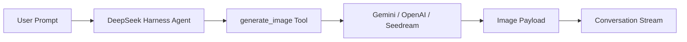

<div align="center">

# 🎨 dsh-image-gen

### Native Image Generation Plugin for DeepSeek Harness (DSH)

**Bring ChatGPT-like image generation into DeepSeek Harness conversation flows.**

Supports Google Gemini, OpenAI Images, OpenAI Compatible APIs, ByteDance Seedream / Volcengine Ark.

[](https://www.npmjs.com/package/dsh-image-gen)
[](https://github.com/deepseek-ai)
[](https://www.npmjs.com/package/dsh-image-gen)
[](LICENSE)

**English** | [简体中文](README.md)

<br />

<p align="center">💬 <b>Just prompt your DeepSeek Harness Agent:</b></p>

```text
Install the image generation plugin by running: pnpm dsh plugin --profile web add dsh-image-gen
```

<p align="center"><sub>(Or run manually in terminal: <code>pnpm dsh plugin --profile web add dsh-image-gen</code>)</sub></p>

<br />

<p align="center">Once installed, configure your API Key in DSH Settings and prompt your Agent:</p>

```text
Create an illustration of a cyberpunk cat in a neon rainy street.
```

<p align="center">The Agent will automatically invoke <code>generate_image</code> and render the generated image directly in the conversation flow.</p>

<br />


</div>

---

## 💡 What Problem Does It Solve?

**`dsh-image-gen` is an open-source multimodal image generation bundle built specifically for DeepSeek Harness (DSH).**

DeepSeek Harness already lets Agents dispatch tools to accomplish complex tasks; this plugin equips DSH with native **multimodal image generation capabilities**:



---

## 🚀 Quick Start

### 1. Install Plugin

Run the following command in your DeepSeek Harness workspace root:

```bash
# Recommended: Install and register plugin via pnpm
pnpm dsh plugin --profile web add dsh-image-gen

# If dsh is installed globally:
dsh plugin --profile web add dsh-image-gen
```

<details>
<summary><b>🛠️ Advanced Installation (Git Repository / Local Dev)</b></summary>

```bash
# Option B: Direct install from GitHub repo
pnpm dsh plugin --profile web add git+https://github.com/shanliuling/dsh-image-gen.git

# Option C: Local clone for development
git clone https://github.com/shanliuling/dsh-image-gen.git
pnpm dsh plugin --profile web add ./dsh-image-gen
```

</details>

### 2. Configure API Key

Open DSH Web UI (default `http://localhost:3080`):

1. Go to **Settings → Plugins → Image generation**.
2. Select your Provider, enter your API Key, and click **Save**.

<div align="center">
  
</div>

### 3. Start Generating Images in Chat

Simply prompt in the chat input:

```text
Generate a minimalist illustration of a modern architectural living room.
```

The Agent will automatically invoke `generate_image` and render the result in the conversation.

---

## ✨ Key Features

- 💬 **In-Conversation Image Generation**: No need to switch between external websites or manually copy prompts; ask your Agent naturally.
- 🎨 **Multi-Provider Support**: Out-of-the-box support for Google Gemini, OpenAI Images, OpenAI Compatible APIs (OneAPI, NewAPI), and ByteDance Seedream / Volcengine Ark. Models and endpoints can be customized directly in the settings UI.
- 🔑 **BYOK (Bring Your Own Key)**: Uses your own API credentials securely managed through DSH's write-isolated `credentials` service. Keys are never saved in plain text on the frontend.
- 🖼️ **Durable Session Attachments**: Images are attached to DSH's native Attachment / Conversation system and remain visible when returning to historical sessions.
- ⚙️ **Native Settings UI**: Change providers, API keys, models, and endpoints directly inside the DSH Web UI without manual config file editing.

---

## 📦 Supported Providers

| Provider | Default Model | Default Endpoint / Base URL |
| :--- | :--- | :--- |
| **Google Gemini** | `gemini-3.1-flash-image` | `https://generativelanguage.googleapis.com/v1beta/interactions` |
| **OpenAI Images** | `gpt-image-2` | `https://api.openai.com/v1` |
| **OpenAI Compatible** | Custom | Custom Base URL |
| **ByteDance Seedream / Volcengine** | `doubao-seedream-5-0-260128` | `https://ark.cn-beijing.volces.com/api/v3` |

---

## 🛠️ Development

```bash
# Clone repository
git clone https://github.com/shanliuling/dsh-image-gen.git
cd dsh-image-gen

# Install dependencies and build
pnpm install
pnpm run typecheck
pnpm run test
pnpm run build

# Check package payload
pnpm run pack:check
```

---

## 📄 License

This project is licensed under the [MIT License](LICENSE).

If this plugin helps you, consider giving it a ⭐️ **Star**!
