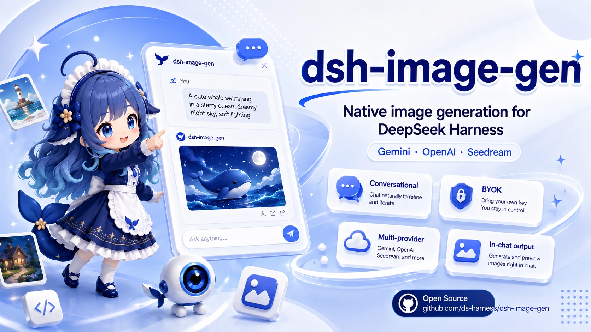
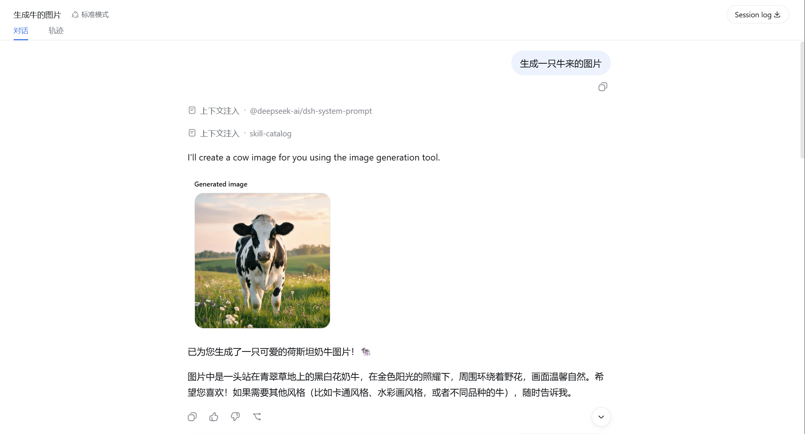
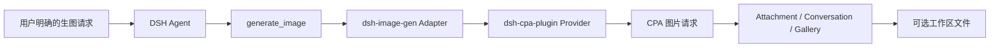

<div align="center">



<br /><br />

# 🎨 dsh-image-gen

**通过 DeepSeek Harness 和 CPA Provider 在对话中生成图片，并保留原生 Attachment、Gallery 与工作区保存能力。**

[](https://www.npmjs.com/package/dsh-image-gen)
[](https://github.com/deepseek-ai)
[](LICENSE)

[English](README.en.md) | **简体中文**

<br />

<p align="center">安装 Provider 和 Adapter 后，直接告诉 Agent：</p>

```text
帮我画一张雨夜霓虹街头的赛博朋克猫咪。
```

<p align="center">Agent 会在明确的生图请求中调用 <code>generate_image</code>，并把结果附加到当前对话。</p>

<br />



</div>

---

## 架构

`dsh-image-gen` 是只负责工具、Attachment、Gallery 和工作区输出的 Adapter。模型 ID、请求协议和凭据由先安装的 `@LiuRJ99/dsh-cpa-plugin` Provider 持有；ImageGen 设置页不保存 Provider key。



## 安装与配置

在 DSH Web profile 中按顺序安装 Provider，再安装 Adapter：

```bash
dsh plugin --profile web add @LiuRJ99/dsh-cpa-plugin
dsh plugin --profile web add dsh-image-gen@0.4.0
```

本地发布包也使用同一命令形状：

```bash
dsh plugin --profile web add <provider-package-or-tarball>
dsh plugin --profile web add <image-plugin-package-or-tarball>
```

随后在 CPA Provider 的配置中完成模型路由与凭据配置，并确认 Host route 中存在 `gpt-image-2` 或 `gemini-3.1-flash-image`。在 **Settings → Plugins → Image generation** 中只选择 engine（`GPT Image 2` 或 `Gemini Image`）以及工作区保存开关和文件夹；不要把旧版 Provider、API key、Endpoint 或 raw model 字段当作当前方案。

普通模型选择器会隐藏图片专用模型 `gpt-image-1.5`、`gpt-image-2` 和 `gemini-3.1-flash-image`；`gemini-3.1-flash-lite` 仍作为普通文本模型显示。

## 两条 CPA 协议路径

| Engine | CPA 请求路径 | 图片结果 |
| :--- | :--- | :--- |
| **GPT Image 2** | `/v1/images/generations` | `data[].b64_json` |
| **Gemini Image** | `/v1/chat/completions` | `choices[0].message.images[].image_url.url` |

两种 engine 都由 `generate_image` 触发；成功结果由 Adapter 保存为 Attachment，并显示在当前对话中，工作区保存是可选的。

## 主要能力

- 💬 对话中显式调用 `generate_image` 生成图片。
- 🖼️ 图片进入 DSH Attachment、Conversation 和原生 Gallery。
- 💾 可将成功生成的图片保存到当前会话工作区。
- 🎨 通过 CPA Provider 统一承载模型路由、协议和凭据，Adapter 不读取或保存 Provider key。

## 本地开发

```bash
pnpm install
pnpm run typecheck
pnpm run test
pnpm run build
pnpm run pack:check
```

## 开源协议

本项目基于 [MIT License](LICENSE) 开源。
