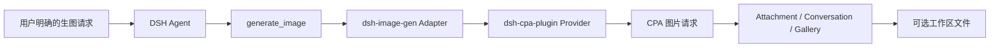

<div align="center">


<br /><br />

# 🎨 dsh-image-gen

**通过 DeepSeek Harness 和 CPA Provider 在对话中生成图片，并保留原生 Attachment、Gallery 与工作区保存能力。**

[](https://www.npmjs.com/package/dsh-image-gen)
[](https://github.com/deepseek-ai)
[](LICENSE)

[English](README.en.md) | **简体中文**

<br />

<p align="center">安装 Provider 和 Adapter 后，直接告诉 Agent：</p>

```text
帮我画一张雨夜霓虹街头的赛博朋克猫咪。
```

<p align="center">Agent 会在明确的生图请求中调用 <code>generate_image</code>，并把结果附加到当前对话。</p>

<br />


</div>

---

## 架构

`dsh-image-gen` 是只负责工具、Attachment、Gallery 和工作区输出的 Adapter。模型 ID、请求协议和凭据由先安装的 `@LiuRJ99/dsh-cpa-plugin` Provider 持有；ImageGen 设置页不保存 Provider key。



## 安装与配置

当前 `@LiuRJ99/dsh-cpa-plugin` 是同仓库的 private Provider，不能假定已发布到公共 registry；在 monorepo/内部 profile 中先安装 sibling package 或用户批准的 Provider tarball，再安装 Adapter：

```bash
dsh plugin --profile web add <path-to-dsh-cpa-plugin-or-approved-provider-tarball>
dsh plugin --profile web add dsh-image-gen@0.5.0
```

若 Provider 已由目标 profile 内部发布，也可以使用其确切包名。Adapter 的 peer range 不会把 private Provider 伪装成可独立安装的公共依赖；没有 Provider 时生图路由不可用。

本地发布包也使用同一命令形状：

服务端缩略图使用 DSH Host 已提供的 `sharp` peer，不要再向 Web profile 单独安装一份 `sharp`，以免加载重复的原生 `libvips`。

```bash
dsh plugin --profile web add <provider-package-or-tarball>
dsh plugin --profile web add <image-plugin-package-or-tarball>
```

随后在 CPA Provider 的配置中完成模型路由与凭据配置，并确认 Host route 中存在 `gpt-image-2` 或 `gemini-3.1-flash-image`。在 **Settings → Plugins → Image generation** 中只选择 engine（`GPT Image 2` 或 `Gemini Image`）以及工作区保存开关和文件夹；不要把旧版 Provider、API key、Endpoint 或 raw model 字段当作当前方案。

普通模型选择器会隐藏图片专用模型 `gpt-image-1.5`、`gpt-image-2` 和 `gemini-3.1-flash-image`；`gemini-3.1-flash-lite` 仍作为普通文本模型显示。

## 两条 CPA 协议路径

| Engine | CPA 请求路径 | 图片结果 |
| :--- | :--- | :--- |
| **GPT Image 2** | `/v1/images/generations` | `data[].b64_json` |
| **Gemini Image** | `/v1/chat/completions` | `choices[0].message.images[].image_url.url` |

两种 engine 都由 `generate_image` 触发；成功结果由 Adapter 保存为 Attachment，并显示在当前对话中，工作区保存是可选的。

## 主要能力

- 💬 对话中显式调用 `generate_image` 生成图片。
- 🖼️ 图片进入 DSH Attachment、Conversation 和原生 Gallery。
- 💾 可将成功生成的图片保存到当前会话工作区。
- 🎨 通过 CPA Provider 统一承载模型路由、协议和凭据，Adapter 不读取或保存 Provider key。

## 灵感与 Gallery 管理

- **灵感素材库**：内置固定 allowlist 的公开案例，支持分类、风格、场景筛选、搜索、收藏、复制 Prompt，以及选择 GPT Image 2 或 Gemini Image 后通过 CPA 生成。素材图片优先使用固定镜像，再回退到 jsDelivr/GitHub；浏览器只能提交 case ID，不能提交任意 URL。
- **缓存边界**：素材索引/图片的浏览器 IndexedDB 缓存有大小上限；Host 的可选磁盘缓存位于 `~/.dsh/cache/dsh-image-gen/inspiration`，错误会降级为内置 SVG，不影响生图。刷新和清理会清除插件缓存；第三方网络仅访问代码中固定的 HTTPS 源。
- **Gallery 管理**：Better Sidebar Gallery 保留 fork 的 DB v3、缩略图/原图缓存与虚拟化 Grid/Table，并增加 favorites、批量选择/删除、当前 workspace filter、Prompt 复制和 CPA-only 重新生成。列表视图会显示完整 Prompt。
- **工作区治理**：普通 `generate_image` 只写当前 agent session 的 cwd，并使用原子写入和 realpath containment。动态发现的 DSH workspace 只用于严格的根目录校验；浏览器批量删除只接受已保存的生成文件路径，重新生成的浏览器请求只创建 Attachment，不扩大写盘授权。

## 明确的 deferred 能力

当前 CPA service 只有 `generate` 合同，因此本 Adapter **不实现也不宣称支持** native `edit_image`、Studio 原生 Provider backend、多模型原生对比或 `provider=comfyui`。编辑、多参考、Studio/ComfyUI 与 Provider/BYOK/API key 配置均保留为后续 CPA contract 设计，不会在本插件中读取或保存。

## 本地开发

```bash
pnpm install
pnpm run typecheck
pnpm run test
pnpm run build
pnpm run pack:check
```

## 开源协议

本项目基于 [MIT License](LICENSE) 开源。
