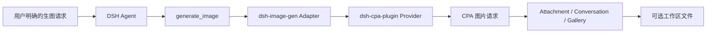

<div align="center">


<br /><br />

# 🎨 dsh-image-gen

**通过 DeepSeek Harness 和 CPA Provider 在对话中生成图片，并保留原生 Attachment、Gallery 与工作区保存能力。**

[](https://www.npmjs.com/package/dsh-image-gen)
[](https://github.com/deepseek-ai)
[](LICENSE)

[English](README.en.md) | **简体中文**

<br />

<p align="center">安装 Provider 和 Adapter 后，直接告诉 Agent：</p>

```text
帮我画一张雨夜霓虹街头的赛博朋克猫咪。
```

<p align="center">Agent 会在明确的生图请求中调用 <code>generate_image</code>，并把结果附加到当前对话。</p>

<br />


</div>

---

## 架构

`dsh-image-gen` 是只负责工具、Attachment、Gallery 和工作区输出的 Adapter。模型 ID、请求协议和凭据由先安装的 `@LiuRJ99/dsh-cpa-plugin` Provider 持有；ImageGen 设置页不保存 Provider key。



## 安装与配置

`dsh-image-gen` 当前按 **source build → tarball** 交付，不把源码 checkout 当作可直接 Git 安装的独立包。跨机器或稳定运行时，必须使用经过批准的 CPA Provider artifact 和 image-gen 精确版本/ tarball；不要使用 `#main`、`@latest` 或 A 机器的 `link:`。

先安装并验证 CPA Provider，再安装 Adapter：

```bash
# 1. 安装 CPA Provider (v0.4.1)
dsh plugin --profile web add "github:LiuRJ99/dsh-cpa-plugin#v0.4.1"

# 2. 下载并安装经过验证的 v0.5.3 Release Tarball
curl -fL \
  https://github.com/LiuRJ99/dsh-image-gen/releases/download/v0.5.3/dsh-image-gen-0.5.3.tgz \
  -o /tmp/dsh-image-gen-0.5.3.tgz
dsh plugin --profile web add /tmp/dsh-image-gen-0.5.3.tgz
```

没有 Provider service contract 时，image-gen 不可用。服务端缩略图使用 DSH Host 已提供的 `sharp` peer，不要再向 Web profile 单独安装一份 `sharp`，以免加载重复的原生 `libvips`。

### 从源码构建交付物

源码构建需要把 CPA 和 image-gen 放在受控的 staging 布局中，因为当前开发 manifest 使用 `../dsh-cpa-plugin` 作为本地构建 sibling。先构建 CPA，再构建 image-gen：

```text
staging/
  dsh-cpa-plugin/
  dsh-image-gen/
```

```bash
cd staging/dsh-cpa-plugin
pnpm install --frozen-lockfile
pnpm run typecheck
pnpm run bundle

cd ../dsh-image-gen
PNPM_CONFIG_IGNORE_SCRIPTS=true pnpm install --frozen-lockfile
pnpm run typecheck
pnpm run test
pnpm run build
pnpm run pack:check
pnpm run pack:artifact -- --pack-destination /tmp/dsh-image-gen-artifacts
```

将生成的 tarball 安装到 candidate profile，验证通过后再安装到正式 `web` profile。`pack:artifact` 会从最终发布 manifest 中移除仅用于源码构建的本地 sibling `devDependency`；不要手工修改生成的 tarball。

### 本机开发 link

只有在当前机器已经完成构建并确认入口文件存在时，才允许在 `web-dev` profile 使用 link：

```bash
dsh plugin --profile web-dev add -w \
  "dsh-image-gen@link:/absolute/path/to/staging/dsh-image-gen"
```

`link` 只引用当前机器的目录，不执行安装、prepare 或 build，也不能迁移到另一台机器。

随后在 CPA Provider 的配置中完成模型路由与凭据配置。ImageGen 设置页会从 CPA Host 的专用图片模型目录读取可用模型，按 GPT/Gemini 引擎筛选并保存具体 `model`；浏览器不会直连 CPA，也不会接触 API key。没有图片模型目录或使用旧版 Provider 时，仍回退到 Provider 的默认图片模型。

普通模型选择器会隐藏 CPA 标记为图片专用的模型；已知旧版 CPA 模型 `gpt-image-1.5`、`gpt-image-2` 和 `gemini-3.1-flash-image` 仍兼容隐藏，`gemini-3.1-flash-lite` 仍作为普通文本模型显示。

## 两条 CPA 协议路径

| Engine | CPA 请求路径 | 图片结果 |
| :--- | :--- | :--- |
| **GPT 图片模型** | `/v1/images/generations` | `data[].b64_json` |
| **Gemini 图片模型** | `/v1/chat/completions` | `choices[0].message.images[].image_url.url` |

两种 engine 都由 `generate_image` 触发；成功结果由 Adapter 保存为 Attachment，并显示在当前对话中，工作区保存是可选的。

## 主要能力

- 💬 对话中显式调用 `generate_image` 生成新图片，或调用 `edit_image` 编辑、合成和重绘已有图片。
- 🖼️ 新图和编辑结果都进入 DSH Attachment、Conversation 和原生 Gallery。
- 💾 可将成功生成的图片保存到当前会话工作区。
- 🎨 通过 CPA Provider 统一承载模型路由、协议和凭据，Adapter 不读取或保存 Provider key。

## 灵感与 Gallery 管理

- **灵感素材库**：内置固定 allowlist 的公开案例，支持分类、风格、场景筛选、搜索、收藏、复制 Prompt，以及选择 GPT Image 或 Gemini Image 后通过 CPA 生成。素材图片优先使用固定镜像，再回退到 jsDelivr/GitHub；浏览器只能提交 case ID，不能提交任意 URL。
- **缓存边界**：素材索引/图片的浏览器 IndexedDB 缓存有大小上限；Host 的可选磁盘缓存位于 `~/.dsh/cache/dsh-image-gen/inspiration`，错误会降级为内置 SVG，不影响生图。刷新和清理会清除插件缓存；第三方网络仅访问代码中固定的 HTTPS 源。
- **Gallery 管理**：Better Sidebar Gallery 保留 fork 的 DB v3、缩略图/原图缓存与虚拟化 Grid/Table，并增加 favorites、批量选择/删除、当前 workspace filter、Prompt 复制和 CPA-only 重新生成。列表视图会显示完整 Prompt。
- **工作区治理**：普通 `generate_image` 只写当前 agent session 的 cwd，并使用原子写入和 realpath containment。动态发现的 DSH workspace 只用于严格的根目录校验；浏览器批量删除只接受已保存的生成文件路径，重新生成的浏览器请求只创建 Attachment，不扩大写盘授权。

## 参考图编辑

当前 CPA service 在保留 `generate` 向后兼容的同时提供可选 `edit` 能力。`edit_image` 会在 Host 侧读取当前用户消息中的 DSH Attachments，并按上传顺序传给 CPA；也支持显式 `source_attachment_ids` 和受 workspace containment 保护的 `source_paths`。GPT 使用 `/v1/images/edits`，Gemini 使用带 `image_url` data URL 的 `/v1/chat/completions`。

旧版 CPA Provider 如果没有 `edit` 方法，插件只注册 `generate_image`，不会伪造 `edit_image`，也不会通过 shell 复制附件。Studio 原生 Provider backend、多模型原生对比、`provider=comfyui` 和 Provider/BYOK/API key 配置仍不属于本插件。

## 本地开发检查

本仓库不是独立的 Provider checkout；本地检查必须先准备相邻 CPA sibling，并按“CPA bundle → image-gen build → pack artifact”的顺序执行。最少执行：

```bash
PNPM_CONFIG_IGNORE_SCRIPTS=true pnpm install --frozen-lockfile
pnpm run typecheck
pnpm run test
pnpm run build
pnpm run pack:check
```

要交付跨机器物料，另外执行 `pnpm run pack:artifact -- --pack-destination <directory>`。

## 开源协议

本项目基于 [MIT License](LICENSE) 开源。
