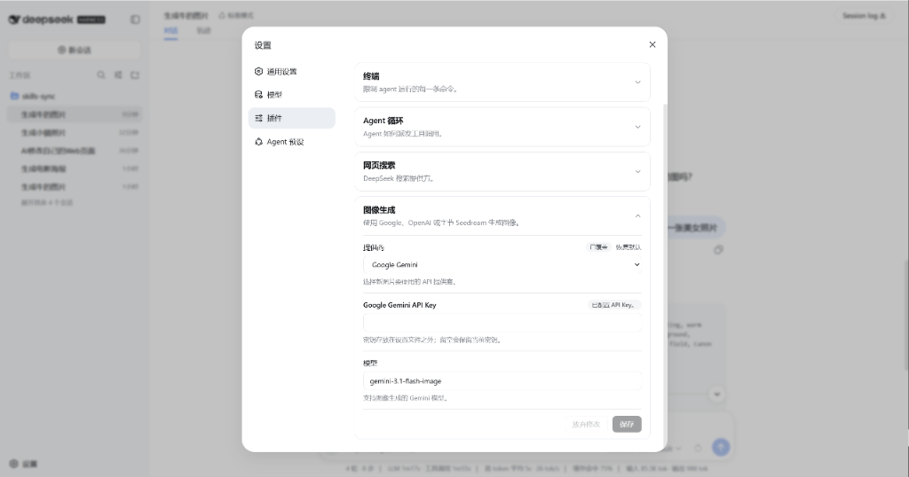

# dsh-image-gen

[English](README.md) | 简体中文

`dsh-image-gen` 是适用于 DeepSeek Harness (DSH) 的多厂商生图 Bundle 插件。它向智能体注册 `generate_image` 工具，并在 Web 对话流中直接持久化渲染高清图片卡片。


---

## ✨ 核心特性

- **多厂商生态支持**：原生支持 **Google Gemini**、**OpenAI / 兼容中转站 (OneAPI/NewAPI)** 以及 **字节火山方舟 Seedream (豆包绘图)**。
- **安全凭证隔离**：借助 DSH `credentials` 服务实现 API Key 仅写入保护，前端防读取，后端内存透传，杜绝密钥泄露风险。
- **开箱即用设置面板**：无缝集成至 DSH 设置中心，自动带出最新推荐模型与默认地址，支持自定义反代及一键还原官方地址。
- **附件持久化存储**：生成的图片自动入库 DSH 附件体系（Attachment），会话历史完整可溯。



---

## 📦 支持厂商与默认规范

| 厂商 (Provider) | 凭据环境变量 | 默认模型 | 默认接口地址 (Endpoint / Base URL) | 协议说明 |
| :--- | :--- | :--- | :--- | :--- |
| **Google Gemini** | `GEMINI_API_KEY` | `gemini-3.1-flash-image` | `https://generativelanguage.googleapis.com/v1beta/interactions` | Google 原生 Interactions 协议 |
| **OpenAI / 中转站** | `OPENAI_API_KEY` | `gpt-image-2` | `https://api.openai.com/v1` | 标准 OpenAI `/v1/images/generations` |
| **字节 Seedream** | `ARK_API_KEY` | `doubao-seedream-5-0-260128` | `https://ark.cn-beijing.volces.com/api/v3` | 火山方舟豆包文生图标准网关 |

---

## 🚀 安装与使用

### 1. 安装插件

在你的 DeepSeek Harness 工作区中安装本插件（以默认 `web` profile 为例）：

```bash
# 方式 A：npm 安装（发布后）
dsh plugin --profile web add dsh-image-gen

# 方式 B：本地开发引入
dsh plugin --profile web add /path/to/dsh-image-gen
```

### 2. 在 Web 界面配置

1. 打开 DSH Web 页面（默认 `http://localhost:3080`）。
2. 进入 **设置 (Settings) → 插件 (Plugins) → 图像生成 (Image generation)**。
3. 选择厂商，填入对应的 API Key，确认或自定义接口地址与模型，点击 **保存**。

### 3. 在对话中触发生图

新建对话，直接向大模型输入绘图提示词即可：
> *"生成一只牛来的图片"* 或 *"帮我画一张在雨夜霓虹街头的赛博朋克猫咪"*

模型将自动调用 `generate_image` 工具生成图片，并在对话中渲染出精美卡片。

---

## 🛠️ 本地开发与构建

```bash
# 安装依赖
pnpm install

# 类型检查
pnpm run typecheck

# 运行单元测试
pnpm run test

# 编译 Node 端与浏览器端产物
pnpm run build

# 预打包检查
pnpm run pack:check
```

---

## 📄 开源协议

[MIT](LICENSE)

